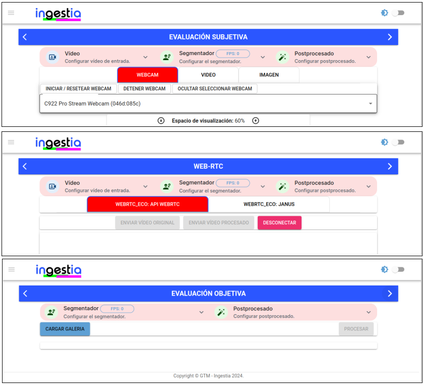
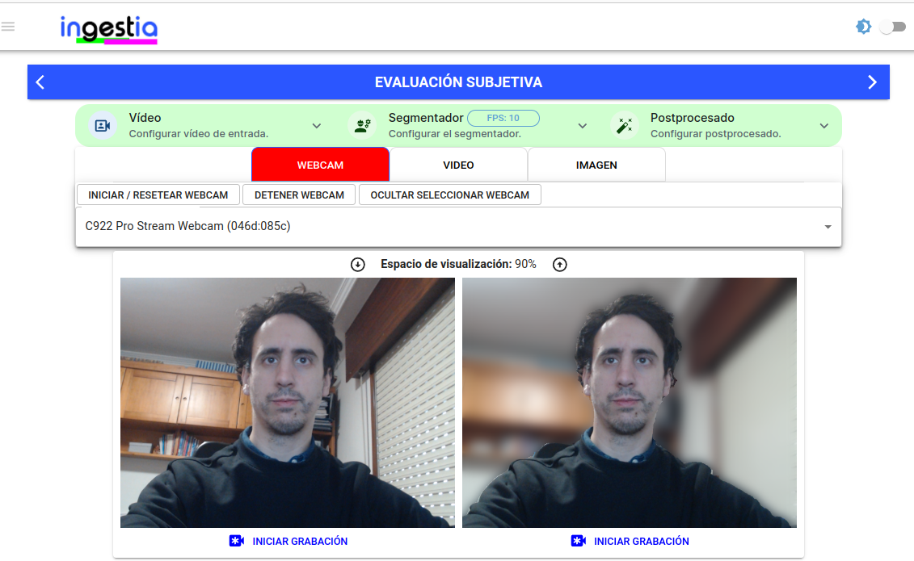
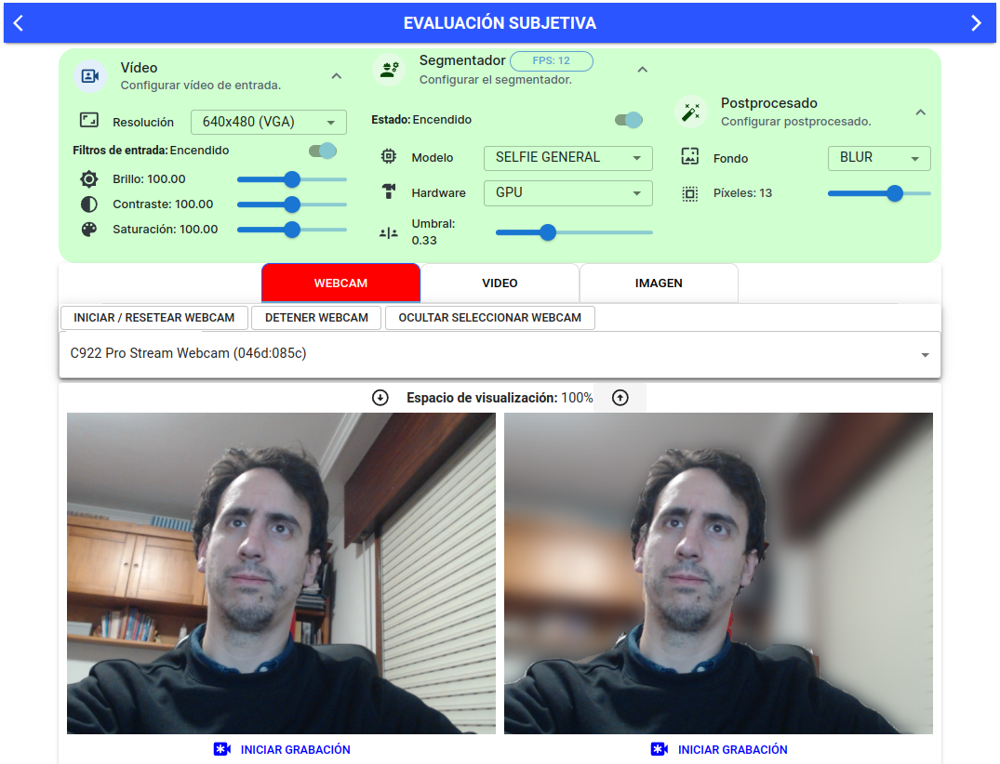
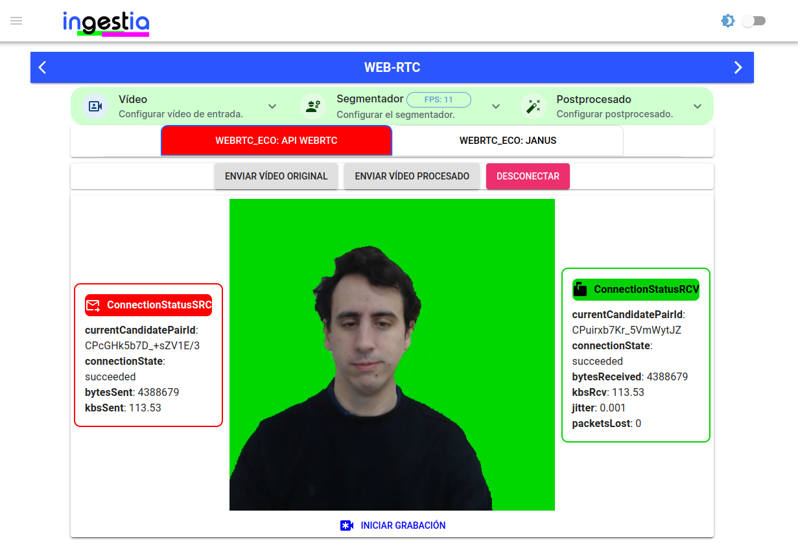
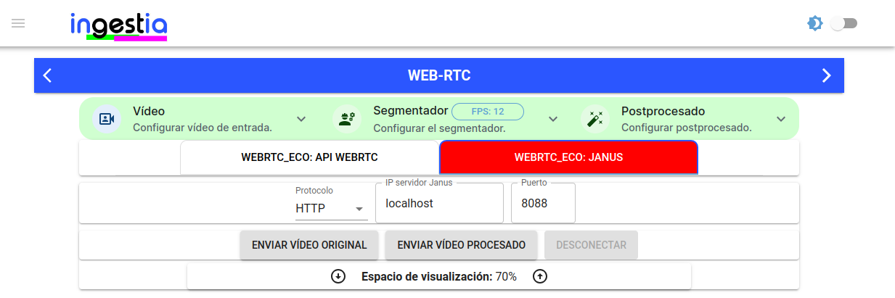
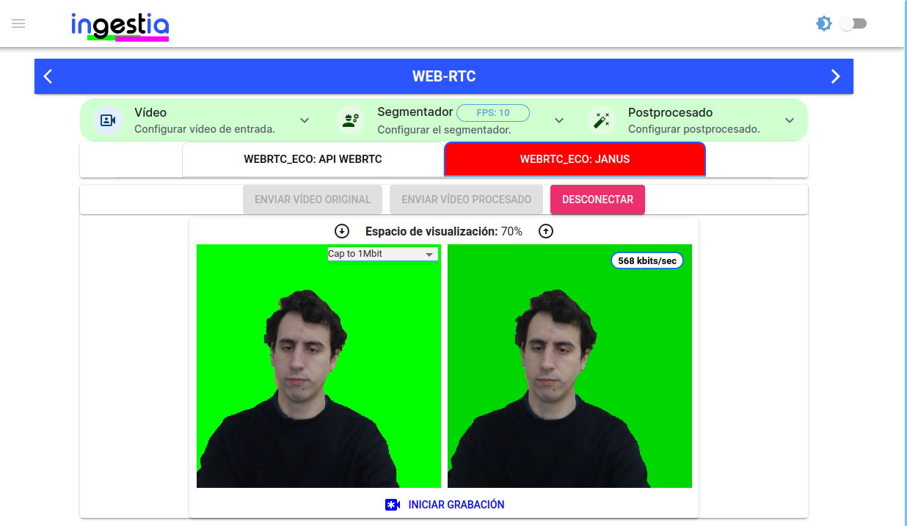
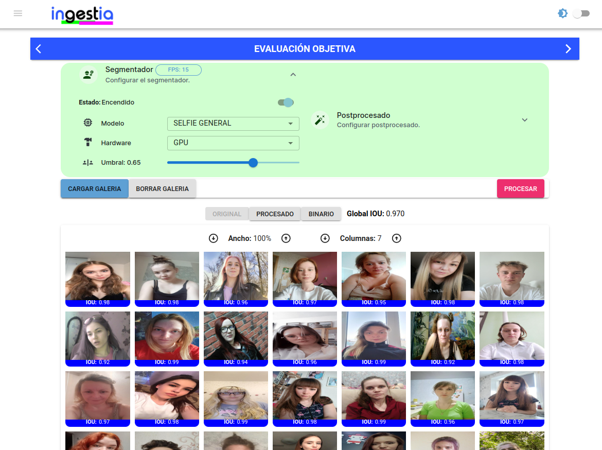

# ANÁLISIS DE LAS HERRAMIENTAS DE PROCESADO DE VÍDEO PARA LA MODIFICACIÓN DEL FONDO EN TIEMPO REAL EN EL FLUJO DE VÍDEO
## Repositorio colaboración UVIGO - QUOBIS ( Proyecto INGESTIA ) 

#### Enlace web: [Web de ingestiaGTM](https://ingestiagtm.web.app/)

---------

### Prerequisitos
* React >= 18.17.1
* npm >= 9.6.7

---------
### Primeros pasos
1. Clonar repositorio
2. Instalar los paquetes necesarios:  npm install
3. Iniciar aplicación web: npm start

-------
### Screenhots web:
#### Secciones - vista general.

  

#### Sección Subjetiva.

  

#### Sección WebRTC.

#### Sección Objetiva.

------

#### Recursos
* [Modelos (.tfile)](https://firebasestorage.googleapis.com/v0/b/ingestiagtm.appspot.com/o/models.zip?alt=media&token=3ef20792-7b2c-4890-8445-52bf1e5880c5)
* [Resultados - prestaciones (.json)](https://firebasestorage.googleapis.com/v0/b/ingestiagtm.appspot.com/o/results_json_files.zip?alt=media&token=3bdc7ad9-8096-4a46-8464-0dd1f3e32608)
* [Resultados - imágenes segmentadas](https://firebasestorage.googleapis.com/v0/b/ingestiagtm.appspot.com/o/results_img_out.zip?alt=media&token=4a6538ea-68d5-4f85-bf1e-108da3245404)

